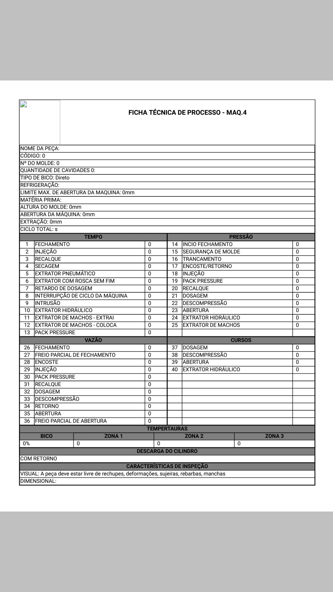

<h1 align="center">FICHA DE PROCESSOS MÁQ INJETORA</h1>

 

## Aplicativo criado com React-native-cli para estudo de:
- rotas e navegação
- criação de formulários
- utilização de bibliotecas de terceiros
- permissão do usuário(fazendo algumas modificações no arquivo AndroidManifest.xml)
- criação de layout simples

 

## Tecnologias
- React native
- react-native-html-to-pdf
- react navigation

 

## Objetivo

 O aplicativo tem como foco passar os parâmetros da máquina injetora para um template HTML, e através desse template, gerar um arquivo em PDF. No final do processo podemos imprimir ou arquivar o PDF criado no computador da empresa, e assim diminuir o armazenamento de papéis.

 

## Imagens do Aplicativo

 

 
 

## Template HTML 

- Template onde os dados do formulário são inseridos.

